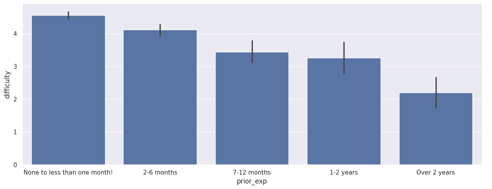
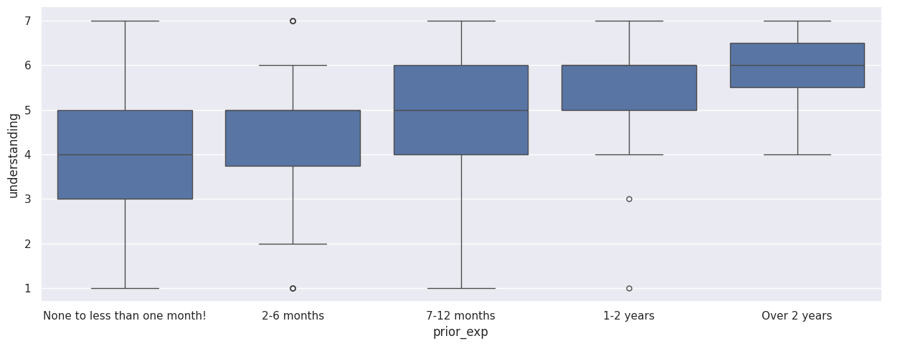
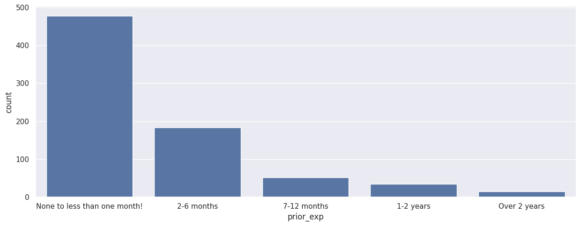

# Beginners vs. Experienced Students in COMP110
*By Dylan Patel*

## Summary

In this project, I looked at the anonymized survey from the course COMP110, where I aimed to test the need for differentiated assistance depending on the level of previous programming knowledge of the students. In this survey, students provided data regarding their previous programming knowledge along with various outcomes such as understanding, course difficulty, and how often they visited the professor during office hours. All 764 surveys were divided according to `prior_exp`.

## The Idea

The course must cater to the learners' experience with programming because learners who come into the class without previous exposure will definitely have needs that differ from those of learners who are entering the course after having taken the AP Computer Science course or learning programming elsewhere.

## Findings

Approximately 63% of students come into COMP110 without any prior knowledge of programming at all, making true beginners the dominant subgroup in the course.

When categorized according to prior experience, students who came into the course with no experience before reported significantly lower self-reported understanding than students who had any level of prior experience. This is clearly a monotonic trend where any additional prior experience means an increase in the median understanding score.

The same pattern appears with perceived difficulty (1 = Very Easy, 7 = Very Difficult). Beginners reported the highest difficulty on average, and students with over two years of experience reported the lowest, with a gradient between them.

## Conclusion

The data supports the idea. In all three outcomes (understanding, difficulty, OH visits), the beginners found the course significantly harder compared to each other group, and there is a clear monotonic relationship. Around 63% of the class is made up of true beginners, so the group that will be affected is also the biggest.

**Costs and trade-offs:** Differentiated instruction needs additional effort from the TAs; having a different track might feel like discrimination against beginners; pacing slower to accommodate beginners may demotivate experienced learners; and planning for a split track is complicated logistically.

**Further extensions:** Provide optional workshops for beginners without creating a completely distinct track; provide bonus "stretch" exercises for the experienced group; conduct another survey halfway through the semester to determine if the disparity narrows by the end; and examine the interaction between `prior_exp` and `oh_effective` to verify if OH benefits beginner learners.